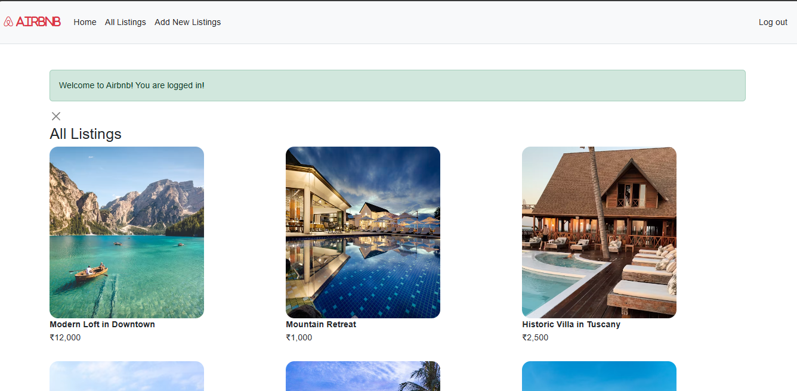
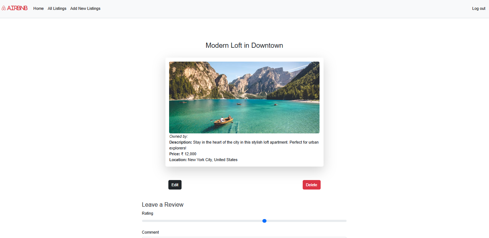
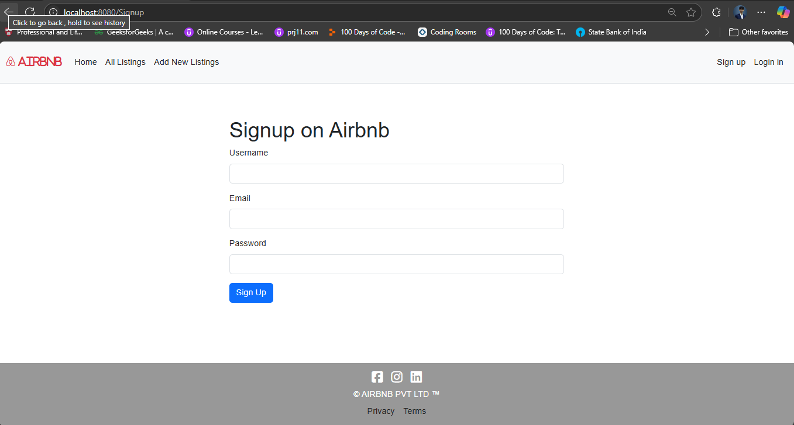
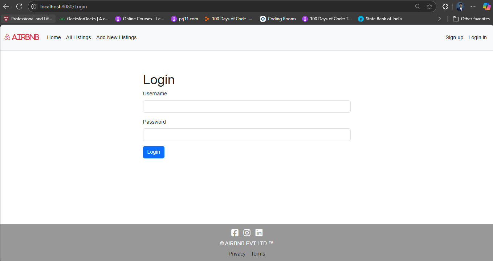

# 🌍 Wonderlust

Wonderlust is a full-stack travel listings web application built using **Node.js**, **Express.js**, **MongoDB**, **Mongoose**, and **Passport.js**. Users can register, log in, and create, edit, or delete travel listings with reviews.Wonderlust is a full-stack travel listings web application that enables users to share, discover, and review amazing travel destinations around the world. Built using the Node.js ecosystem, Wonderlust follows the MVC architecture and provides robust features such as authentication, authorization, CRUD functionality, review system, and form validation — making it a comprehensive platform for travel enthusiasts.


---

## 📸 Screenshots

### Project Dashboard

This project includes several views that represent different sections of the application.

<div style="display: flex; justify-content: space-around; margin-bottom: 20px;">
  <div style="text-align: center;">
    
    <p><strong>Dashboard</strong></p>
  </div>
  <div style="text-align: center;">
    
    <p><strong>Main View</strong></p>
  </div>
  <div style="text-align: center;">
    
    <p><strong>Sign up</strong></p>
  </div>
  <div style="text-align: center;">
    
    <p><strong>Login </strong></p>
  </div>
</div>


## 🚀 Features

- 📝 Create, read, update, and delete travel listings.
- 💬 Leave reviews on listings.
- 🔐 User authentication and authorization.
- 🔒 Route protection for logged-in users and owners only.
- ⚡ Flash messages for feedback.
- 🧾 Form validation with Joi.
- 🗂️ Clean MVC structure.

## 🛠️ Technologies Used

- **Backend**: Node.js, Express.js
- **Frontend**: EJS, ejs-mate (templating)
- **Database**: MongoDB, Mongoose
- **Authentication**: Passport.js, express-session
- **Validation**: Joi
- **Utilities**: method-override, connect-flash

## 📦 Installation

1. **Clone the repository**:
   ```bash
   git clone https://github.com/Swayam29082004/Airbnb
   cd Airbnb
   npm install
   DB_URL=mongodb://localhost:27017/wonderlust
   SECRET=your_secret_key
   node init/data.js
   nodmon app.js
   
```bash
project-root/
│
├── controllers/                  # Route logic & controllers
│   ├── listing.js
│   └── user.js
│
├── init/
│   └── data.js                   # Sample data or DB seed logic
│
├── models/                       # Mongoose data models
│   ├── index.js
│   ├── listing.js
│   ├── review.js
│   └── user.js
│
├── node_modules/                # Node.js dependencies (auto-generated)
│
├── public/                      # Public static files
│   ├── css/
│   └── js/
│
├── routes/                      # Express route handlers
│   ├── listing.js
│   ├── review.js
│   └── user.js
│
├── screenshots/                 # Screenshots for documentation/demo
│   ├── screenshot1.png
│   ├── screenshot2.png
│   ├── screenshot3.png
│   └── screenshot4.png
│
├── utils/                       # Utility functions and error handlers
│   ├── ExpressError.js
│   └── wrapAsync.js
│
├── views/                       # EJS views/templates
│   ├── includes/
│   │   ├── flash.ejs
│   │   ├── footer.ejs
│   │   └── navbar.ejs
│   ├── layouts/
│   │   └── boilerplate.ejs
│   ├── listings/
│   │   ├── edit.ejs
│   │   ├── error.ejs
│   │   ├── index.ejs
│   │   ├── new.ejs
│   │   └── show.ejs
│   └── user/
│       ├── login.ejs
│       └── signup.ejs
│
├── .gitignore                   # Git ignored files
├── app.js                       # Main Express application
├── middleware.js                # Custom middleware
├── package.json                 # Project metadata and scripts
├── package-lock.json            # Exact versions of installed dependencies
├── README.md                    # Project documentation
└── schema.js                    # Joi validation schemas

## ✅ Future Enhancements
- 🌐 **Google Maps API for Geolocation**  
  Integrate Google Maps to display and select listing locations.
- 📸 **Image Upload with Cloudinary Integration**  
  Allow users to upload listing images using Cloudinary's image hosting service.
- 🌟 **Ratings System**  
  Implement a star-based rating system for listings and reviews.
- 📅 **Booking Calendar**  
  Add calendar support to book or reserve dates for listings.
- 🧪 **Test Coverage with Jest or Mocha**  
  Ensure application reliability and functionality through unit and integration testing.

## 📝 License
|  This project is licensed under the MIT License - see the LICENSE file for details.|